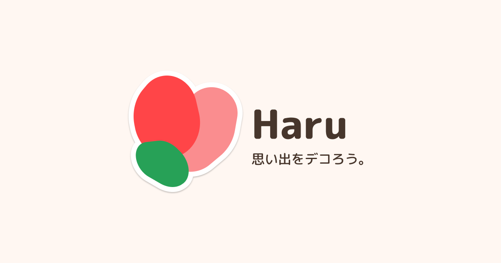

# Haru - 思い出をデコろう。



**友だちと一緒に作る思い出に、シールを貼り合う。温かい体験を、デジタルで。**

## なぜ作ったのか

シール帳をご存知でしょうか？お気に入りのシールを台紙に貼ってコレクションしていくノート。子どもの頃に夢中になった方も多いかもしれません。

実は今、このシール集めが再びブームになっています。Googleトレンドで「シール帳」を検索すると、ここ1年で検索数は右肩上がり。若い世代から大人まで、幅広い層で楽しまれていることがわかります。

### 発見した2つの課題

SNSでシール帳の投稿を調べる中で、私たちは2つのことに気づきました。

1. **過去の思い出を振り返りにくい**  
   紙のシール帳は、後から見返すのが意外と大変です。

2. **「見てほしい」というニーズ**  
   多くの人がシール帳をSNSに投稿しています。これは単にシールを集めたいのではなく、自分がデコレーションした作品を誰かに見てもらいたい、共有したいという欲求の表れだと考えました。

### Haruが実現すること

「Haru」は、シールを貼るという体験を通じて、もっと自由に、もっと楽しく友だちとコミュニケーションできるプラットフォームです。

友だちと一緒に作る思い出に、思い思いのシールを貼り合う。そんな温かい体験を、デジタルで実現しました。

## 3つの特徴

### 1. ステッカーで伝える、新しいリアクション

投稿の好きな場所に、ステッカーを自由に貼り付けられます。可愛いスタンプ、絵文字、テキスト、画像など、言葉以外の表現でリアクション可能。回転させたり、大きさを変えたり、自由に配置して、みんなでひとつの思い出を完成させていきます。

### 2. まるで本をめくるような体験

ひとつの投稿が、ひとつのページに。ページをめくるように次の投稿へ進むUI/UXは、まるで本物の本を読んでいるような感覚を生み出します。スマートフォンに最適化された直感的な操作で、心地よく思い出を辿れます。

### 3. いつでも、何度でも、思い出を振り返れる

デジタルだからこそできる、思い出との新しい向き合い方。日付や友だち、キーワードで簡単に検索でき、あの日の思い出にすぐアクセス。紙のシール帳のように「どこに貼ったっけ？」と探し回る必要はありません。時系列で並んだタイムラインをスクロールすれば、懐かしい記憶が次々と蘇ります。大切な思い出は、いつまでも色褪せることなく、手のひらの中に。

## 使い方

1. **アカウント作成**: GoogleやLINEで登録
2. **思い出を作る**: 友達と共有できる思い出を作成。背景色も自由に選べます
3. **投稿する**: 本文と画像（任意）を投稿
4. **ステッカーを貼る**: 友達の投稿をタップして、好きな場所にステッカーを配置
5. **ページをめくる**: スワイプで次のページへ。友達との思い出を一緒に楽しく作り上げることができます

## 主な機能

- **投稿作成**: テキストと画像（1枚）を投稿。画像は正方形にトリミング
- **ステッカー貼付**: 投稿の任意の位置にステッカーを配置（回転・拡大縮小可能）
- **ページめくりUI**: スワイプ/ドラッグで次の投稿へ移動する直感的な操作
- **共有思い出**: 複数人で一つの思い出を共有して楽しめる
- **フォロー機能**: 気になるユーザーをフォローして新着をチェック
- **削除制限**: ステッカーが貼られた投稿は削除不可（思い出の保護）
- **アクセシビリティ対応**: スクリーンリーダー対応、コントラストAA準拠

---

## 技術詳細

### 技術スタック

#### フロントエンド

- TypeScript
- Next.js App Router
- React
- CSS Modules Kit
- Jotai

#### バックエンド

- Better Auth
- Turso DB
  - SQLite
- Drizzle
  - ORM
- Cloudflare R2
  - 画像ストレージ
- next-safe-action
  - 型安全なServer Actions

#### コード品質

- ESLint
- Prettier
- Stylelint
- Lefthook
- Storybook

### データベース設計

- **user**: ユーザー情報（認証情報、プロフィール）
- **session**: 認証セッション管理（Better Auth）
- **follows**: フォロー関係
- **diaries**: 思い出情報（タイトル、背景色）
- **diaryMembers**: 思い出とメンバーの関連
- **posts**: 投稿情報（本文、画像URL）
- **stickers**: ステッカー配置情報（座標、回転、スケール）

### 主要な技術的工夫

#### 本文のPNG画像化

クライアント側で`Canvas`/`OffscreenCanvas`を使用して本文をPNG画像化。これにより:

- 統一されたデザインで投稿を表示
- ステッカーを貼る「キャンバス」として機能
- アクセシビリティのため生テキストも保持

#### ステッカー座標システム

- デバイスサイズに依存しない配置を実現
- 回転（-180°〜180°）、スケール（0.25〜2.0）をサポート

---

## セットアップ

### 1. 依存関係のインストール

```bash
pnpm install
```

### 2. 環境変数の設定

`.env.example`を基に`.env`を作成

### 3. データベースマイグレーション

```bash
pnpm run db:generate
pnpm run db:push
```

### 4. 開発サーバーの起動

```bash
pnpm run dev
```

ブラウザで [http://localhost:3000](http://localhost:3000) を開きます。

### その他のコマンド

```bash
pnpm run build          # 本番ビルド
pnpm run typecheck      # 型チェック
pnpm run lint:fix       # リンター自動修正
pnpm run db:studio      # DB管理画面起動
pnpm run storybook      # Storybook起動
```

---

## 📁 プロジェクト構造

```
src/
├── app/                    # Next.js App Router
│   ├── (public)/          # ログイン前のページ
│   │   ├── login/
│   │   └── register/
│   ├── (protected)/       # ログイン後のページ
│   │   ├── users/         # ユーザープロフィール
│   │   ├── diaries/       # 思い出
│   │   ├── new/           # 思い出作成
│   │   └── settings/      # 設定
│   └── api/auth/          # 認証API
├── components/             # 汎用コンポーネント
│   ├── ui/                # UIコンポーネント
│   └── block/             # ブロックコンポーネント
├── libs/                   # ユーティリティ
│   └── drizzle/           # DBスキーマ
├── clients/                # クライアント設定
│   ├── auth/              # 認証
│   ├── db/                # DB接続
│   └── env/               # 環境変数
└── types/                  # 型定義
```
